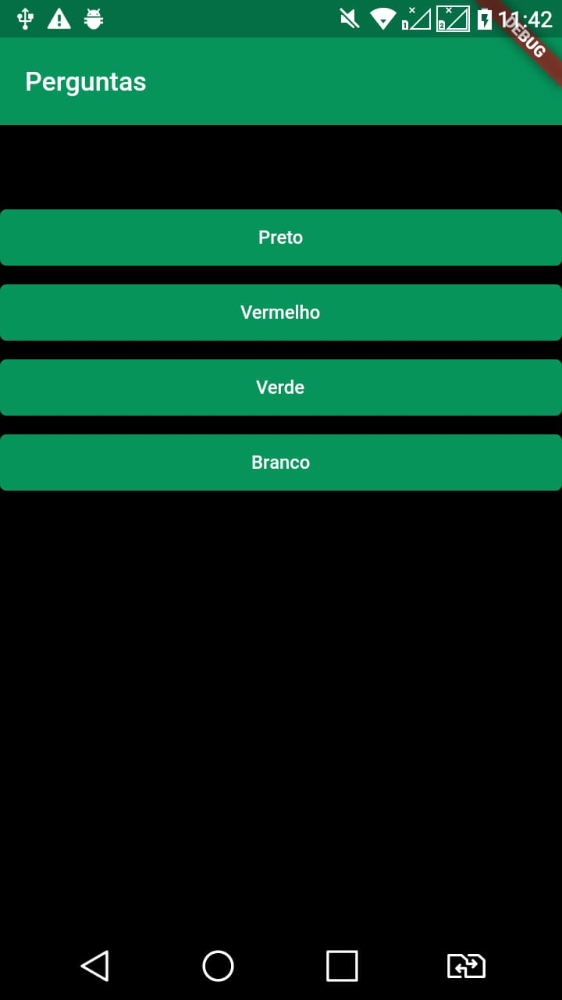
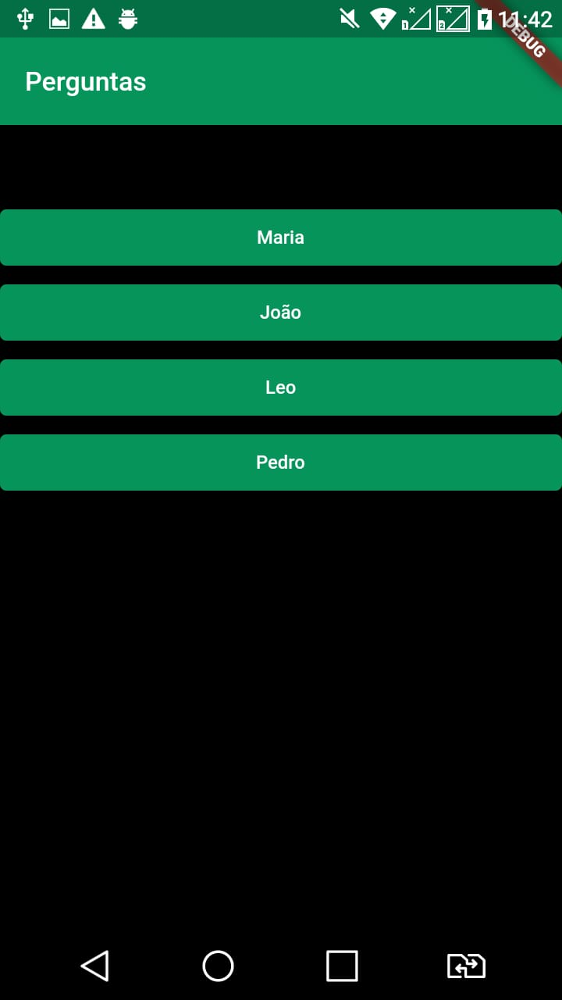

### Projeto Perguntas

Um projeto bem simples feito em Flutter para começar os estudos na área de desenvolvimento mobile, o aplicativo realiza perguntas aleatórias e dependendo de sua resposta o APP vai colocar qual nível você estar colocado de acordo com sua respostas. 

  
  
  
  

